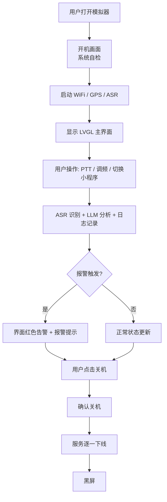

# AI 无线电控制台 Web 模拟器 — 产品需求文档

## 1. 产品概述

本项目是一个基于 Web 的 **AI 无线电控制台全流程模拟器**，用于在浏览器中完整复现 Gemini-S1（Allwinner R528 + openvela）开发板上运行的 AI 无线电控制台体验。模拟器覆盖从开机、系统底层初始化、LVGL 主界面运行、内置 JS 小程序、AI 实时识别到关机的完整流程，帮助评审与演示者直观理解系统架构与人机交互。

## 2. 核心功能

### 2.1 功能模块

1. **开机启动画面**：品牌 Logo、系统服务加载进度、启动日志滚动。
2. **系统底层状态面板**：实时显示 CPU 负载、内存占用、WiFi 连接状态、GPS 坐标、音频输入 VU 表、温度。
3. **LVGL 主界面（AI 电台状态页）**：频率/模式显示、PTT 状态、ASR 实时转写、LLM 分析摘要、报警级别、GPS 位置。
4. **内置软件 / JS 小程序坞**：可切换的小程序视图——电台日志、系统设置、GPS 地图、频谱瀑布图、LLM 分析历史。
5. **模拟控制面板**：物理按键模拟（PTT、Menu、Vol+/-、Home）、频率/模式调节、WiFi/GPS/ASR 开关、场景注入（求救信号、违规通联、正常 CQ）。
6. **关机流程**：确认对话框、服务关闭动画、黑屏。

### 2.2 页面详情

| 页面/视图 | 模块 | 功能描述 |
|-----------|------|----------|
| 开机画面 | Boot | Logo、版本号、服务启动进度条、滚动日志 |
| 底层面板 | System | CPU/Mem/WiFi/GPS/Audio/Temperature 实时仪表 |
| 主界面 | Radio | LVGL 风格 AI 电台状态屏 |
| 小程序坞 | Apps | 可切换的日志/设置/地图/频谱/历史小程序 |
| 控制面板 | Controls | 模拟实体按键与场景注入 |
| 关机画面 | Shutdown | 确认与关闭动画 |

## 3. 核心流程

用户进入页面后自动进入开机流程：系统自检 → 初始化 WiFi/GPS/ASR → 加载 LVGL 主界面 → 用户可通过控制面板触发 PTT 说话、切换频率/模式、打开小程序 → 系统实时展示 ASR partial/final、LLM 分析、报警、日志记录 → 用户点击关机 → 确认 → 服务逐一下线 → 黑屏。

## 4. 用户界面设计

### 4.1 设计风格

- **主题**：工业无线电控制台 + 复古 CRT 科技感，深色背景。
- **主色**：深灰/炭黑背景 `#0a0a0f`，琥珀/橙色强调 `#ff9f1c`，红色报警 `#ff3b30`，绿色正常 `#2ecc71`，蓝色信息 `#3498db`。
- **字体**：
  - 显示/标题：等宽科技感字体 `Share Tech Mono` 或 `Orbitron`
  - 正文：`JetBrains Mono` 或 `Roboto Mono`
- **组件风格**：
  - 旋钮与滑块采用拟物化金属/霓虹风格。
  - LED 状态指示灯带发光效果。
  - VU 表、进度条使用分段式 LED 外观。
  - 卡片带细微边框与内阴影，模拟设备面板。
- **动效**：
  - 开机进度条与日志逐行打印。
  - 报警时顶部条与背景红/暗交替闪烁。
  - 旋钮旋转、VU 表跳动、频谱瀑布滚动。
  - 小程序切换使用淡入/滑动过渡。

### 4.2 页面设计概览

| 页面 | 模块 | UI 元素 |
|------|------|---------|
| 开机画面 | Boot | 中央 Logo、环形进度条、底部日志终端 |
| 底层面板 | System | 6 个仪表卡片、实时折线图、状态 LED |
| 主界面 | Radio | 大字号频率、模式标签、ASR 文本区、LLM 摘要卡片、报警横幅、GPS 坐标 |
| 小程序坞 | Apps | 底部 Dock 栏、可切换内容区 |
| 控制面板 | Controls | PTT 大按钮、频率旋钮、模式选择、开关按钮、场景注入按钮 |
| 关机画面 | Shutdown | 模态确认框、服务关闭进度 |

### 4.3 响应式

- 桌面优先，默认以 1280×800 开发板屏幕比例展示。
- 支持 1024px 以上桌面自适应；移动端仅做基础缩放，核心体验面向平板/开发板屏幕。

## 5. 非功能需求

- 所有动画使用 CSS/JS 实现，60fps。
- 不依赖外部后端，所有数据通过浏览器内模拟生成。
- 代码结构清晰，便于后续替换为真实硬件数据。
