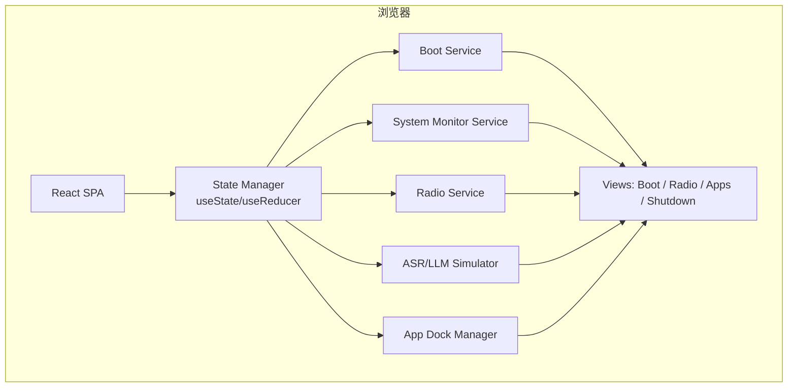

# AI 无线电控制台 Web 模拟器 — 技术架构文档

## 1. 架构设计



## 2. 技术选型

- **前端框架**：React 18 + TypeScript
- **构建工具**：Vite 5
- **样式**：Tailwind CSS 3
- **路由**：单页面，状态驱动视图切换（无 React Router）
- **图标**：Lucide React
- **字体**：Google Fonts `Orbitron` + `JetBrains Mono`
- **动画**：CSS transitions/keyframes + Web Animations API（无重型动画库）
- **后端**：无，所有数据在浏览器内模拟

## 3. 视图与状态定义

| 视图 | 状态值 | 说明 |
|------|--------|------|
| boot | `view: 'boot'` | 开机画面 |
| radio | `view: 'radio'` | AI 电台主界面 |
| apps | `view: 'apps'` | 小程序坞 |
| shutdown | `view: 'shutdown'` | 关机画面 |
| off | `view: 'off'` | 黑屏 |

## 4. 核心状态结构

```typescript
interface AppState {
  view: 'boot' | 'radio' | 'apps' | 'shutdown' | 'off';
  bootProgress: number;
  bootLogs: string[];
  system: {
    cpu: number;
    memory: number;
    temperature: number;
    wifiConnected: boolean;
    wifiSSID: string;
    gpsFix: boolean;
    latitude: number | null;
    longitude: number | null;
    altitude: number | null;
    audioLevel: number;
  };
  radio: {
    frequency: number; // Hz
    mode: 'USB' | 'LSB' | 'FM' | 'AM' | 'CW';
    pttActive: boolean;
    squelch: number;
  };
  asr: {
    transcript: string;
    partial: string;
    isRecording: boolean;
  };
  analysis: {
    summary: string;
    alertLevel: 'NONE' | 'INFO' | 'WARNING' | 'MAYDAY' | 'INTERFERENCE' | 'MALICIOUS';
    location: string;
  };
  logs: LogEntry[];
  activeApp: 'log' | 'settings' | 'map' | 'spectrum' | 'history';
}
```

## 5. 模拟服务逻辑

### 5.1 Boot Service

- 进入页面后 `view = 'boot'`。
- 每 300ms 推进 `bootProgress`，并追加启动日志。
- 进度 100% 后 500ms 切换到 `radio`。

### 5.2 System Monitor Service

- `setInterval` 每 1s 更新：
  - CPU：随机 10-60%，PTT 时冲高。
  - 内存：随机 45-70%。
  - 温度：随机 42-58°C。
  - WiFi：连接状态由开关控制。
  - GPS：fix 状态由开关控制，坐标在固定基线附近漂移。
  - Audio Level：PTT 时根据场景文本长度模拟跳动。

### 5.3 ASR/LLM Simulator

- PTT 按下 → `isRecording = true`，`audioLevel` 升高。
- PTT 释放 → 根据当前场景注入文本，模拟 ASR final。
- 触发 LLM 分析：根据关键词（求救、违规、干扰）决定 alertLevel。
- 日志追加到 `logs`。

### 5.4 场景注入

| 场景 | ASR 文本示例 | LLM 结果 |
|------|-------------|----------|
| 正常 CQ | "CQ CQ this is BH4XXX" | NONE |
| 求救信号 | "Mayday mayday, this is BH4YYY, vessel sinking" | MAYDAY |
| 违规通联 | "Use this frequency for illegal relay" | MALICIOUS |
| 干扰 | "Strange noise and continuous jamming" | INTERFERENCE |

## 6. 组件结构

```
src/
  App.tsx              # 主入口，状态管理
  components/
    BootScreen.tsx     # 开机画面
    RadioScreen.tsx    # AI 电台主界面
    AppDock.tsx        # 小程序坞
    SystemPanel.tsx    # 系统底层状态面板
    ControlPanel.tsx   # 模拟控制面板
    ShutdownScreen.tsx # 关机画面
    BlackScreen.tsx    # 黑屏
    widgets/
      LEDIndicator.tsx
      VUMeter.tsx
      FrequencyDial.tsx
      AlertBanner.tsx
      LogTerminal.tsx
      SpectrumCanvas.tsx
      MapCanvas.tsx
  hooks/
    useBoot.ts
    useSystemMonitor.ts
    useRadio.ts
    useAsrSimulator.ts
  types/
    index.ts
  index.css
  main.tsx
```

## 7. 构建与运行

- `npm create vite@latest simulator -- --template react-ts`
- `cd simulator && npm install -D tailwindcss postcss autoprefixer && npx tailwindcss init -p`
- `npm install lucide-react`
- `npm run dev` → 本地预览
- 输出目录 `dist/` 可用于静态托管。
